# 업무 기능 분해도 (Functional Decomposition Diagram)

## 1. 시스템 개요

본 시스템은 **회원 관리(Member)**, **게시판(Board)**, **댓글(Reply)** 기능을 제공하는 웹 애플리케이션입니다.

## 2. 기능 분해 다이어그램

```mermaid
graph TD
    Root["Spring Project System"]

    %% Level 1: Modules
    Member["회원 관리 (Member)"]
    Board["게시판 (Board)"]
    Reply["댓글 (Reply)"]

    Root --> Member
    Root --> Board
    Root --> Reply

    %% Level 2: Member Functions
    Member --> M1["로그인 (Login)"]
    Member --> M2["회원가입 (Signup)"]
    Member --> M3["로그아웃 (Logout)"]
    Member --> M4["회원 목록 조회 (Admin Only)"]

    %% Level 2: Board Functions
    Board --> B1["게시글 목록 조회 (List)"]
    Board --> B2["게시글 등록 (Register)"]
    Board --> B3["게시글 상세 조회 (Read)"]
    Board --> B4["게시글 수정 (Modify)"]
    Board --> B5["게시글 삭제 (Remove)"]
    Board --> B6["파일 첨부 (File Attach)"]

    %% Level 2: Reply Functions
    Reply --> R1["댓글 등록 (Register)"]
    Reply --> R2["댓글 목록 조회 (List)"]
    Reply --> R3["댓글 수정 (Modify)"]
    Reply --> R4["댓글 삭제 (Remove)"]
```

## 3. 기능 상세 설명

### 3.1 회원 관리 (Member Management)

| 기능 ID |  기능명   | 설명                                                        | 비고            |
| :-----: | :-------: | ----------------------------------------------------------- | --------------- |
|  M-01   |  로그인   | 사용자의 이메일과 비밀번호를 확인하여 시스템 접속 권한 부여 | Spring Security |
|  M-02   | 회원가입  | 신규 사용자의 정보(이메일, 비밀번호, 닉네임)를 등록         | 비밀번호 암호화 |
|  M-03   | 로그아웃  | 현재 로그인된 사용자의 세션을 종료                          |                 |
|  M-04   | 회원 목록 | (관리자 전용) 등록된 전체 회원 목록을 조회                  | ROLE_ADMIN      |

### 3.2 게시판 (Board Management)

| 기능 ID |   기능명    | 설명                                               | 비고                |
| :-----: | :---------: | -------------------------------------------------- | ------------------- |
|  B-01   |  목록 조회  | 전체 게시글을 페이징 처리하여 목록으로 표시        | 검색 기능 포함      |
|  B-02   | 게시글 등록 | 제목, 내용, 첨부파일을 입력하여 새로운 게시글 생성 |                     |
|  B-03   |  상세 조회  | 특정 게시글의 전체 내용을 확인                     | 조회수 증가         |
|  B-04   | 게시글 수정 | 본인이 작성한 게시글의 제목, 내용, 첨부파일 수정   |                     |
|  B-05   | 게시글 삭제 | 본인이 작성한 게시글을 삭제                        | 논리적 삭제 (isDel) |

### 3.3 댓글 (Reply Management)

| 기능 ID |  기능명   | 설명                                 | 비고        |
| :-----: | :-------: | ------------------------------------ | ----------- |
|  R-01   | 댓글 등록 | 특정 게시글에 대한 의견(댓글)을 등록 | REST API    |
|  R-02   | 댓글 목록 | 특정 게시글에 달린 댓글 목록을 조회  | 페이징 처리 |
|  R-03   | 댓글 수정 | 본인이 작성한 댓글 내용을 수정       |             |
|  R-04   | 댓글 삭제 | 본인이 작성한 댓글을 삭제            |             |
